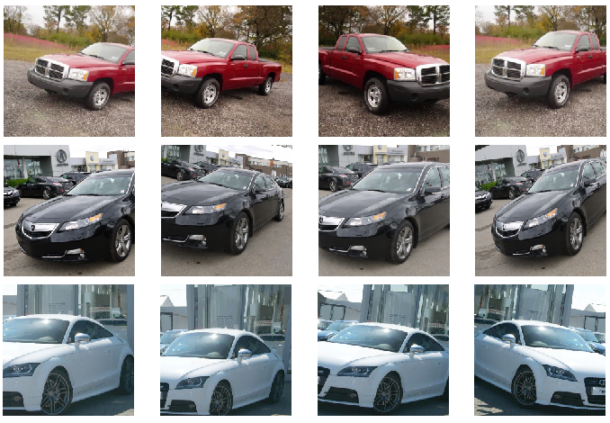
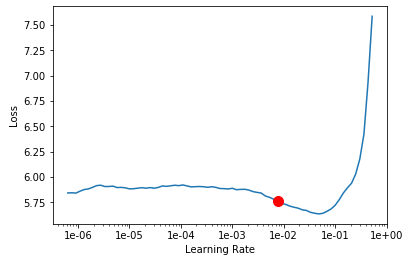
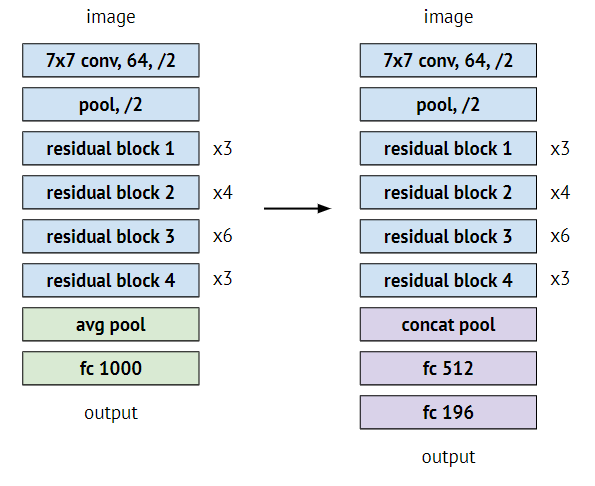
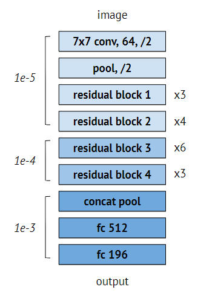

# Grab AI for S.E.A.: Computer Vision Challenge
**Ang Yi Zhe**  
**ang.yizhe@u.nus.edu**  
**https://github.com/lemonwaffle**

*Image taken from: [Grab AI for S.E.A.](https://www.aiforsea.com/computer-vision)*

**Problem Statement**  
> Given a dataset of distinct car images, can you automatically recognize the car model and make?

**Introduction**  
This challenge is a Fine-Grained Image Classification task; where a model has to be built to differentiate between hard-to-distinguish object classes, i.e. the various makes or models of vehicles.

Such an endeavor can prove to be challenging as objects that belong to different classes may only contain subtle differences. In the context of this challenge, my trained models have the most difficulty in differentiating between cars of the same make and model, but produced in different years - a task probably only fit for the most die-hard of car enthusiasts.

**Dataset**  
The dataset for this challenge is the [Stanford Cars Dataset](https://ai.stanford.edu/~jkrause/cars/car_dataset.html). It contains a total of *16,185* images, split into a training set of *8,144* images and a testing set of *8,041* images. The images are labeled at the level of Make, Model, Year, amounting to a total of *196* classes, and additionally contains bounding box labels that localizes the car in each image.

**Evaluation**  
The model should output a confidence score for every classification, and will be evaluated by *accuracy*, *precision*, and *recall*.

**Table of Contents**
<!-- TOC -->

- [Approach](#approach)
    - [1. Summary](#1-summary)
    - [2. Data Preprocessing](#2-data-preprocessing)
    - [3. Model Architectures](#3-model-architectures)
        - [3.1 Inception](#31-inception)
        - [3.2 Squeeze-and-Excitation Network](#32-squeeze-and-excitation-network)
        - [3.3 Dual Path Network](#33-dual-path-network)
    - [4. Optimization](#4-optimization)
    - [5. Training Regime](#5-training-regime)
        - [5.1 Stage-1: Transfer Learning](#51-stage-1-transfer-learning)
        - [5.2 Stage-2: Fine-tuning](#52-stage-2-fine-tuning)
    - [6. Post-processing](#6-post-processing)
    - [7. Ensembling](#7-ensembling)
- [Results](#results)
- [Discussion](#discussion)
- [Appendix A](#appendix-a)
- [Appendix B](#appendix-b)

<!-- /TOC -->
## Approach    
    
### 1. Summary 

I did not attempt to reinvent the wheel; rather, I took this challenge as a learning opportunity for me to, 
1. Familiarize myself with the popular and proven approaches for image classification, 
2. Successfully implement an end-to-end machine learning pipeline, and to
3. Attempt to document my process and results as closely as possible.

My solution was built in large part using the [fast.ai](https://docs.fast.ai) deep learning framework, utilizing their baked in "best practices" to whip out a well-performing model as quickly as possible.

I started off with a tried-and-tested ResNet50 model as a simple baseline, supplemented it with various approaches to get a sense of what works, then finally proceeded to test out larger and more complicated architectures.

Overall, my experimentation consisted of settling on promising hyperparameter settings and a fixed training regime, then iterating on different model architectures to form my final ensemble.

Here is a **TD;LR** of my final approach:

**Validation Scheme**  
- 20% hold-out validation set.
- Split using stratified sampling to preserve class proportions. 

**Data Preprocessing**  
- Images resized as per requirements of pretrained model.
- Normalized using ImageNet statistics to feed into pretrained model.
- Traditional data augmentation + mixup data augmentation.

**Model Architectures**  
- SEResNeXt101
- InceptionNet-v4
- DPN-92 

**Optimization**  
- One-cycle policy
- Adam optimizer 

**Training Regime**  
- Stage-1: Transfer learning, only train classifier head, 30 epochs.
- Stage-2: Fine-tune entire model, using discriminative layer training, 20 epochs.

**Post-processing**  
- Test-time augmentation.

**Ensembling**  
- Ensembled using soft voting of classification scores.

### 2. Data Preprocessing
My data preprocessing primarily comprises steps required to feed my images into a model pretrained using the [ImageNet](https://www.image-net.org) dataset, namely by resizing the images to 224 x 224 or 299 x 299, and the normalizing of pixel values using the ImageNet dataset statistics.

Data augmentation is carried out to artificially increase the size of the dataset and to act as a regularization technique. It works by performing random transformations (flips, rotations, zooms, lighting, etc.) to generate many more realistic variants of each training image  - the images fed into the model should still look like what the model would encounter during deployment. For example, an image of a car flipped horizontally is still a car, but an image of a car flipped vertically probably won't be a very useful training instance for the model; save for identifying overturned cars during accidents.

  
*Figure 1: Examples of Data Augmentation of images*

Another data augmentation technique already implemented by the [fast.ai](https://docs.fast.ai/callbacks.mixup.html) library called [mixup](https://arxiv.org/abs/1710.09412) is also experimented with. Mixup is also a regularization technique that aims to improve the generalizability of models. It achieves this by "mixing up" two images in the form of a linear combination of their pixel values, and the target that is assigned to this new image is also the same combination of the two original targets.

### 3. Model Architectures

Various types of models were explored, and as follows are the best performing ones that were chosen to form the final ensemble.

#### 3.1 Inception

The GoogLeNet architecture that first introduced the [Inception](https://arxiv.org/abs/1409.4842) module won the ILSVRC 2014 challenge. The inception module pioneered the usage of different kernel sizes in a single layer, allowing the model to discern patterns at different scales. 

The latest variant called [Inception-v4](https://arxiv.org/abs/1602.07261) which reached a better performance was chosen.

#### 3.2 Squeeze-and-Excitation Network

The [Squeeze-and-Excitation Network (SENet)](https://arxiv.org/abs/1709.01507) is the winning architecture for ILSVRC 2017. It builds upon existing architectures like InceptionNet and [ResNet](https://arxiv.org/abs/1512.03385) by arming a mini neural network, called a SE Block, to every unit in the original architecture.

Roughly speaking, the SE Blocks improves performance by recalibrating the feature maps produced through learning which features are most often activated together. For example, since mouths, noses and eyes frequently appear together in images, if the block sees that any two of these three features are strongly activated, it will act to increase the activation of the last feature map.

One of the variants called SEResNeXt-101 is chosen.

#### 3.3 Dual Path Network

The [Dual Path Network (DPN)](https://arxiv.org/abs/1707.01629) is the winner of the ILSVRC 2017 Object Localization Challenge. The DPN combines the winning traits of previous successful architectures, namely the feature re-usage of the ResNet and feature exploration of the [DenseNet](https://arxiv.org/abs/1608.06993).

### 4. Optimization

The training technique adopted is the [1cycle policy](https://arxiv.org/abs/1803.09820) proposed by Leslie Smith and evangelized by Jeremy Howard in his [fast.ai course](https://course.fast.ai/). This learning rate schedule recommends a cycle with two steps of equal lengths over the total number of epochs, climbing from a lower learning rate to a higher one, and then back again to the minimum. 

  
*Figure 2: The One Cycle Policy. Taken from [Sylvain](https://sgugger.github.io/the-1cycle-policy.html).*

The maximum learning rate value is chosen by performing a mock training session - gradually increasing the learning rate and plotting the losses after each iteration. The value that corresponds to the steepest slope on the loss curve (somewhere before the minimum, where the loss is still improving) will be chosen.

  
*Figure 3: Learning rate finder plot (Loss against Learning rate).   Here, a learning rate of 1e-2 might be chosen*

The appeal behind that 1cycle policy is that it allows the model to converge to the same performance in a relatively lesser number of epochs.

The [Adam](https://arxiv.org/abs/1412.6980) optimizer is chosen by default. 

### 5. Training Regime

The de facto approach to obtain favourable results on any image classifier as quickly as possible is through transfer learning. The premise is simple: instead of starting from scratch, why not we grab a model already pretrained a large corpus of images as a starting point (the most accessible of which being [ImageNet]())? Of course, the more similar that image dataset is to your own problem task, the better. Even if your task is highly specific, transfer learning still works most of the time as it has been demonstrated that the earlier layers extract local, highly generic feature maps such as visual edges, colors, and textures. 

Transfer learning will not only speed up training considerably, but will also require much less training images.

In order to reuse a pretrained model and fine-tune it carefully, my training regime consists of two stages:

#### 5.1 Stage-1: Transfer Learning

Selecting a model architecture with its weights already pretrained on the ImageNet dataset, the last few layers of the model are cut off to attach a custom classifier head to suit our problem task (i.e. 196 classes of cars instead of 1000 classes for ImageNet). As per fastai's defaults, an Adaptive Concat Pooling layer and two dense layers are strapped on, each separated by dropout and batch normalization layers.

  
*Figure 4: Example of Transfer Learning for the ResNet50.*

In the first stage, only the custom head is trained, while the rest of the layers from the pretrained model are frozen. Since the weights of the custom head will be randomly initialized, you will expect the error gradient that is propagated back to the network to be fairly large, wrecking the fine-tuned weights in the earlier layers. You can view this first stage can simply training a small fully-connected network on the features extracted by the last few layers of the pretrained model.

This stage is run for 30 epochs.

#### 5.2 Stage-2: Fine-tuning

When a reasonably high performance has been reached by training the classifier head, the rest of the model is then unfrozen and fine-tuned. We would still not want to perturb the lower-level features extracted by the earlier layers too wildly, but instead place more emphasis on the later layers to modulate the higher-level abstractions extracted to our own task.

Hence, we will employ discriminative layer training, using a lower learning rate for the earlier layers, but a higher rate for the later layers.

  
*Figure 5: Example of Discriminative Layer Training for the ResNet50.*

This stage is run for 20 epochs.

### 6. Post-processing

In order to make our classifications even more robust, data augmentation is also applied to the test dataset; an approach dubbed as test-time augmentation (TTA). In order to predict the class of every image, multiple augmented copies of each image will be fed into the model, and the final prediction will be an ensemble of those predictions. 

In fastai's implementation, a crop is performed on all four corners of the image, and each of those cropped images are flipped  - generating a total of 8 augmented images. The average of those predictions along with the regular prediction will then be taken as the final prediction.

### 7. Ensembling
Ensembling involves combining the predictions of multiple trained models in order to ensure that the most stable and best possible prediction is made. The set of models chosen for my ensemble are based on their final performance and also on how disparate their model architectures are. This ensures that the errors made by the models won't be as highly correlated, leading to a diverse committee of models that will make robust and generalizable predictions.

The predictions from each model are combined using a simple soft voting of their classification scores.

## Results
Here is a summary of the final results on the test dataset.

| Model        | Accuracy | Accuracy w/ TTA |
|--------------|----------|-----------------|
| Ensemble     | 0.908    | 0.915           |
| SEResNeXt101 | 0.892    | 0.901           |

All the models that form the ensemble are each individually trained within 50 epochs, and have almost the same training regime and hyperparameter values. 

More details of the training results and hyperparameter values can be found in [Appendix A](#appendix-a).

## Discussion

My solution comprised a very straightforward iteration of algorithmic innovations and model architectures, with little error analysis. There is definitely room for further exploration and improvement given more time and compute capability.

I had limited my all my training sessions to 50 epochs in the interest of time and computation requirements. However looking at the training loss values, simple gains in performance could've probably been achieved by training for more epochs as the models do not seem be to overfitting yet. 

The learning rate also seems to have a considerable effect on the final loss convergence and would have been a worthwhile hyperparameter to tune. Mixup could have been turned off as it might have too much of a regularizing effect and possibly performs differently on different architectures.

Other quick fixes include larger models, and also utilizing larger or rectangular image sizes so that the model can pick up finer details.

Since bounding box labels were also provided, a pipeline that consists of object detection, separating the car from the background, and then image classification could've been worth trying out. This will work best if we have limited training data as it will get rid of any bias introduced by details in the environment. However, this will entail the upkeep and training of two different models, and an end-to-end image classification model might've sufficed that learns on its own to separate the foreground from the background. 

[Appendix B](#appendix-b) contains a quick listing of recent-ish deep learning innovations that would be nice to check out (mainly for my own reference). 

## Appendix A
All model experiments share these same hyperparameter values.

| Hyperparameter        | Value         |
|-----------------------|---------------|
| Stage-1 Epochs        | 30            |
| Stage-2 Epochs        | 20            |
| Stage-1 Learning Rate | 1e-2          |
| Stage-2 Learning Rate | (1e-5, 1e-3)* |

_*First value corresponds to learning rate for earlier layers, and second value corresponds to learning rate for the later layers._

Remaining specific values for different model experiments.

| Model           | Batch Size | Image Size | Accuracy | Accuracy w/ TTA |
|-----------------|------------|------------|----------|-----------------|
| SEResNeXt101    | 32         | 224        | 0.892    | 0.901           |
| Inception-v4    | 50         | 299        | 0.889    | 0.897           |
| DPN-92          | 50         | 224        | 0.878    | 0.889           |
| ResNet101       | 50         | 224        | 0.857    | 0.874           |
| EfficientNet-B3 | 32         | 224        | 0.849    | 0.868           |

## Appendix B

- Label smoothing
- Exploration of GANs to synthesize more training images.
- [Pairwise Confusion](https://arxiv.org/abs/1705.08016)
- [Shake-shake regularization](https://arxiv.org/abs/1705.07485)
- [Cutout augmentation](https://arxiv.org/abs/1708.04552)
- [Knowledge Distillation](https://arxiv.org/abs/1503.02531)
- Low precision training; float 16 to speed up computation.
